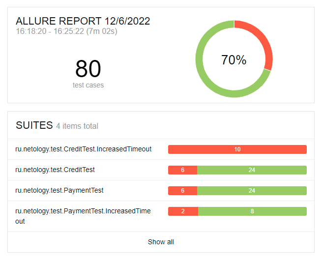

# Отчёт по итогам тестирования

В процессе тестирования:
- были пройдены 80 тест-кейсов (40 для формы обычного платежа, 40 для формы для заявки на кредит)
- ~70% * тест-кейсов были успешно пройдены
- ~30% ** тест-кейсов упали
- добавлены 8 баг-репортов (можно посмотреть [в разделе Issues (фильтр по лейблу bug)](https://github.com/albinamv/QA-Diploma/issues?q=is%3Aopen+is%3Aissue+label%3Abug)
- описаны 4 улучшения (можно посмотреть [в разделе Issues (фильтр по лейблу enhancement)](https://github.com/albinamv/QA-Diploma/issues?q=is%3Aopen+is%3Aissue+label%3Aenhancement)))

*, ** Плавающий процент из-за недостаточных требований по времени ожидания ответа от сервиса. При наилучших условиях: 57 из 80 авто-тестов проходят успешно

