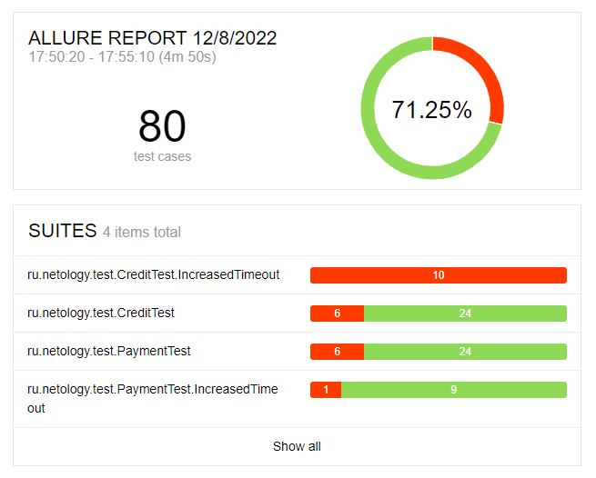
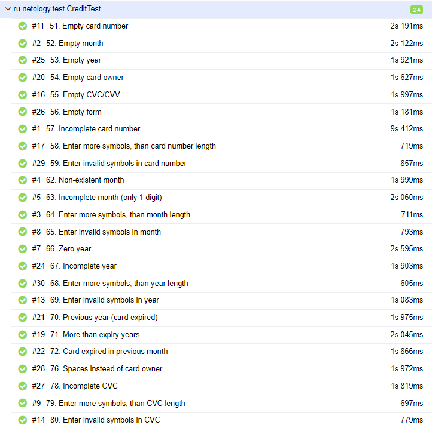
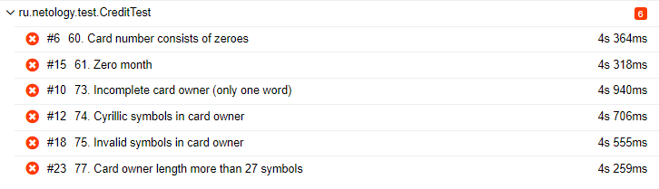
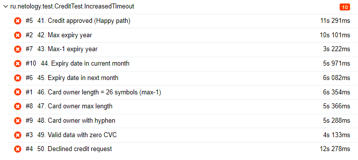
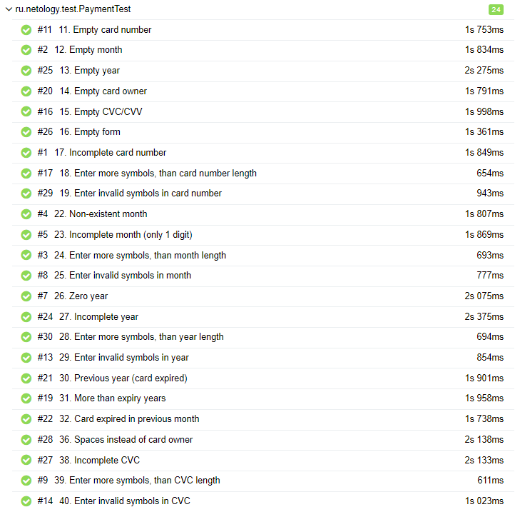
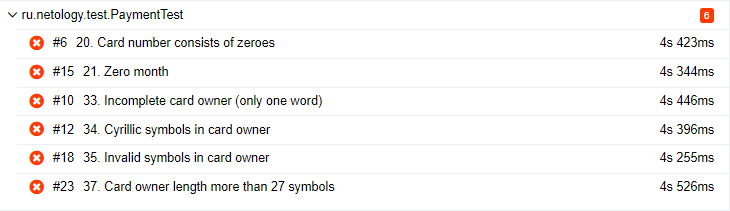
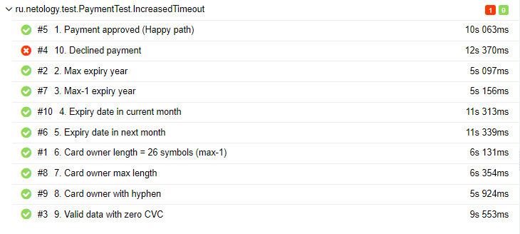

# Отчёт по итогам тестирования

## 1. Планирование
В начале было проведено исследовательское тестирование системы, в результате которого был составлен план тестирования, включающий 80 тест-кейсов для автоматизации (по 40 для каждой формы). [Посмотреть план автоматизации тестирования](https://github.com/albinamv/QA-Diploma/blob/main/docs/Plan.md)

## 2. Автоматизированное тестирование
В процессе автоматизированного тестирования пройдены 80 тест-кейсов (40 для формы обычного платежа, 40 для формы для заявки на кредит), из них:
- пройдены успешно: 57 (71,25%)
- пройдены неудачно: 23 (28,74%)

### По результатам тестирования:
- добавлены 8 баг-репортов ([в разделе Issues (фильтр по лейблу bug)](https://github.com/albinamv/QA-Diploma/issues?q=is%3Aopen+is%3Aissue+label%3Abug)
- описаны 4 улучшения ([в разделе Issues (фильтр по лейблу enhancement)](https://github.com/albinamv/QA-Diploma/issues?q=is%3Aopen+is%3Aissue+label%3Aenhancement)

